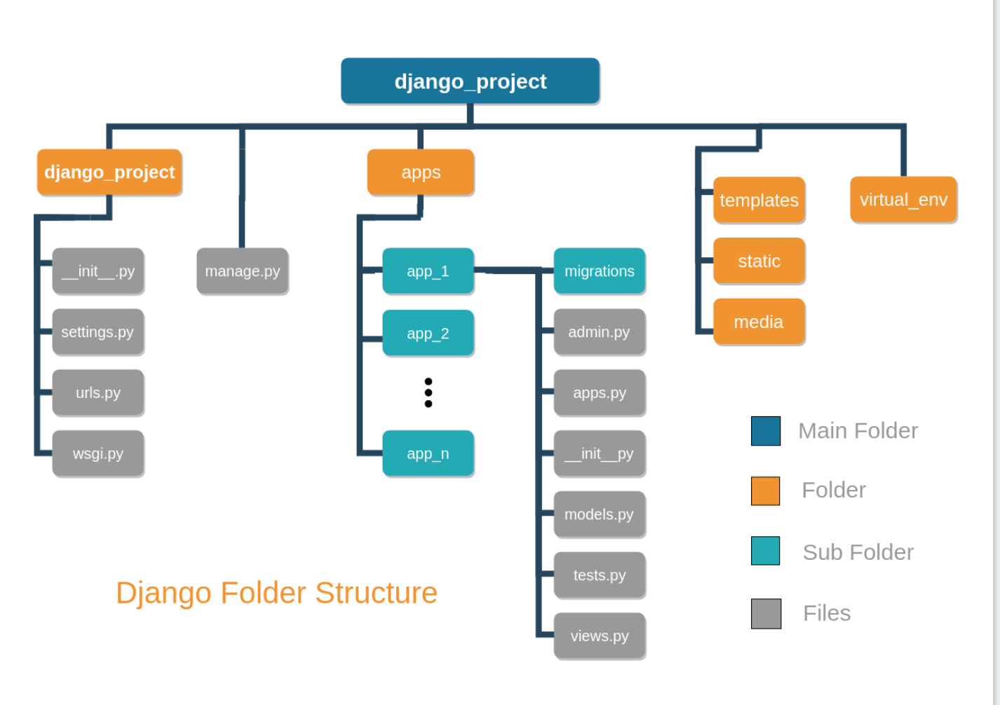

###Fundamentals of Django App design
- Django (project) - web framework
- Django App - are small lib to represent a single aspact of a project
- Django project is made up of many django app
- INSTALLED APPs - list of app/lib

###The golden rule of django app design
- write programs that do one thing and do it well
- each app should be tighly focusssed on its task
- need to divide app (when it is too big)

###Name your django app
- keep to single word name
- TBD
- TBD

###Doubts, keep apps small
- try to keep it small

###Modules belongs in an app
- common app modules - python packages
- uncommon app modules - following are:
  1. `behaviors.py`: An option for locating model mixin.
  2. `constants.py`: A good name for placement of app-level settings.
    If there are enough of them involved in an app, breaking them
    out into their own module, this can add clarity to a project.
  3. `decorators.py`: Where to locate our decorators.
  4. `db/`: Used in many projects for any custom model fields or components.
  5. `fields.py`: is commonly used for form fields, but is sometimes
    used for model fields when there is not enough field code to
    justify creating a db/ package.
  6. `factories.py`: where to place test data factories
  7. `helpers.py`: also as utils.py. Here we put code extracted from view
     and models to make them lighter. code would be reusable.
  8. `managers.py`: When models.py grows too large, to move
     any custom model managers to this modules
  9. `signals.py`: custom signals
  10. `utils.py`: helpers.py
  11. `viewmixins.py`: keeping any view mixin to this
