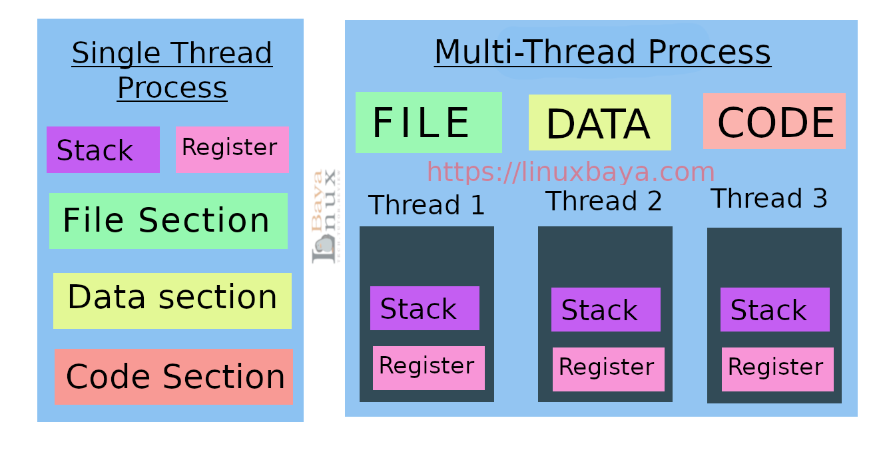

- stack: linear LIFO data structure, containing temporary information.
- register: short-term storage of the data and transfer them
  from one component to another
- file section
- data section
- code section