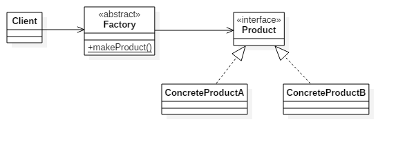

```ruby
  # The Product interface declares the operation that all
  # concrete products must implement
  class Product
    def operation
      raise NotImplementedError, "#{self.class} has not implemented method '#{__method__}"
    end
  end

  # Concrete Prodcuts provide various implementations of
  # the Product interface
  class ConcreteProduct1 < Product
    def operation
      '{Result of the ConcreteProduct1}'
    end
  end

  class ConcreteProduc2 < Product
    def operation
      '{Result of the ConcreteProduc2}'
    end
  end

  class ProductFactory
    def make_product(type)
      case type
      when 'ConcreteProduct1' then ConcreteProduct1.new
      when 'ConcreteProduct2' then ConcreteProduct2.new
      end
    end
  end

  class Client
    def ask
      product_factory = ProductFactory.new

      concrete_product1 = product_factory.make_product('ConcreteProduct1')
      concrete_product1.operation

      concrete_product2 = product_factory.make_product('ConcreteProduct2')
      concrete_product2.operation
    end
  end
```